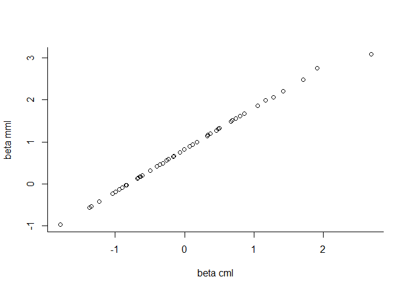

<!-- README.md is generated from README.Rmd. Please edit that file -->

# dexterMML

DexterMML is currently in a beta version. Interfaces to functions should
be reasonably stable and there are no known errors.

## Installation

DexterMML is not on CRAN and can only be installed from github.

``` r
# install.packages("devtools")
devtools::install_github("jessekps/dexterMML")
```

This will work on Windows computers, provided
[Rtools](https://cran.r-project.org/bin/windows/Rtools/) is installed,
and on Linux computers. Mac OS is *not* supported unless you have
installed a C++ compiler with openmp support and configured R to use it.

## Overview

DexterMML is an extension of the R package
[dexter](https://CRAN.R-project.org/package=dexter). Dexter fits IRT
models using Conditional Maximum Likelihood (CML) which is our preferred
method. DexterMML, as the name implies, offers Marginal Maximum
Likelihood (MML) estimation of IRT models.

The main difference is that in MML one needs to assume a population
distribution. Misspecification of that distribution can result in biased
estimation of item parameters. Since CML does not need *a priori*
specification of a population distribution, it is naturally robust
against misspecification. MML also supposes a random sample of the
population which is not needed for CML.

Since assumptions buy information, MML can be used in some circumstances
where CML cannot and it can be used to fit much more elaborate models
(which we do not do -much- but other packages do). Specifically MML can
be used when your dataset includes adaptive or multi stage tests.

DexterMML distinguishes itself from other MML R-packages by:

  - including far fewer models and options
  - being considerably faster
  - support for the dexter data(base) structure

It will be very easy to use if you are alrady familiar with dexter. If
the user desires more flexibility in model choice and estimation
options, they are better of using R packages
[TAM](https://CRAN.R-project.org/package=TAM) or
[mirt](https://CRAN.R-project.org/package=mirt)

## Usage

Using dexterMML is extremely similar to using dexter:

``` r
library(dexter)
library(dexterMML)

db = start_new_project(verbAggrRules, ":memory:")
add_booklet(db, verbAggrData, "agg")

#dexter
cml = fit_enorm(db)
#equivalent in dexterMML
mml = fit_1pl(db)

plot(coef(cml)$beta,coef(mml)$beta, xlab='beta cml', ylab='beta mml')
abline(0,1)
```



dexterMML can also fit a 2pl on an incomplete design and can be used
when there is no pre-specified design, as in random or adaptive tests.

``` r
theta = c(rnorm(1000),rnorm(500,1,2),rnorm(500,-1,.5))
group = rep(letters[1:3],c(1000,500,500))
items = data.frame(item_id=sprintf('item%03i',1:100), item_score=1, 
                   beta=runif(100,-1,1), alpha=rnorm(100,1,.2))

dat = sim_2pl(items, theta)
# a random test of 40 items
for(i in 1:nrow(dat))
  dat[i,sample(1:100,60)] = NA

f1 = fit_1pl(dat,group=group)
f2 = fit_2pl(dat,group=group)

pv1 = plausible_values.mml(dat,f1,covariates=group)
pv2 = plausible_values.mml(dat,f2,covariates=group)

cor(data.frame(theta_true=theta,pv_1pl=pv1$PV1,pv_2pl=pv2$PV1))
#>            theta_true    pv_1pl    pv_2pl
#> theta_true  1.0000000 0.9225198 0.9229646
#> pv_1pl      0.9225198 1.0000000 0.9289892
#> pv_2pl      0.9229646 0.9289892 1.0000000
```
